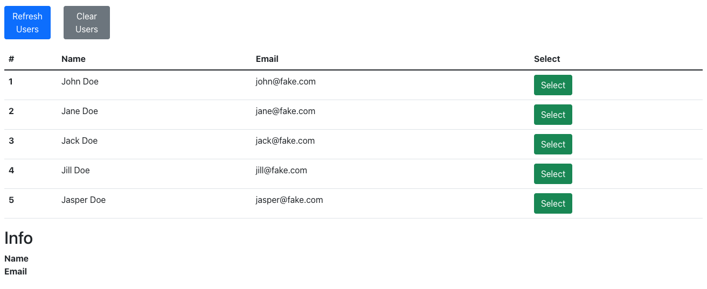
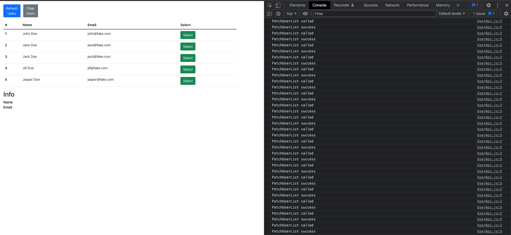
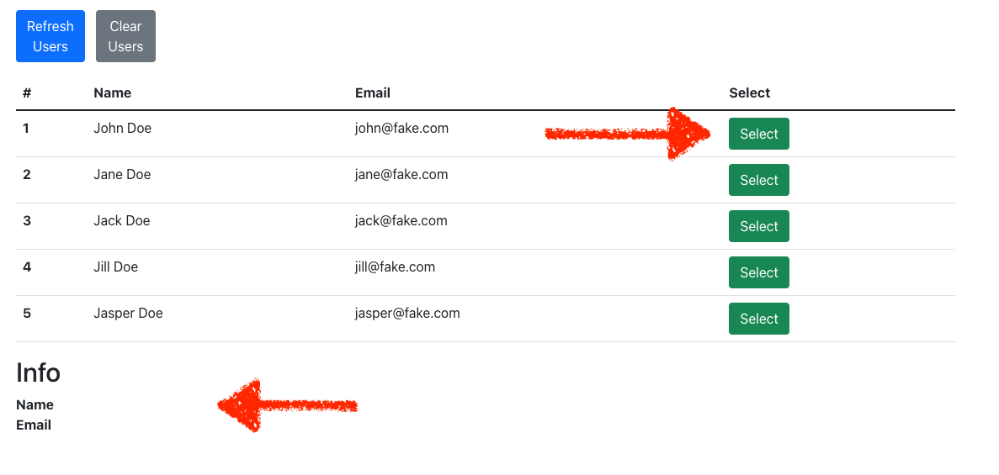

# Problem 1

## Developer Environment Prerequisite

1. NodeJs
3. Chrome Browser

## Steps to run the React Project

1. Go to Desktop and open the Problem 1 Folder in VS Code
2. Launch the VS code app then press **Ctrl+`** to open a terminal.
3. Run `npm install`
4. Run `npm start`
5. The above command will open a new tab in the default browser

_You will see an app like the below screenshot_

## Assessment 1

After opening the app in the browser. Open the Console panel. In Windows, you can use following keyboard shortcut `Control + Shift + J`

In the console you will be able to see that there are infinite calls are going to the Fake server to fetch user list

> Your task is to fix these infinite calls. Also, make sure that `Refresh Users` and `Clear Users` buttons are working

## Assessment 2

In the below screenshot you can see 2 arrows. The top arrow is pointing to the select button. If you click this button nothing is happening.

> Your task is to fix this button click and show the data of the particular user at the place where the bottom arrow is pointing.

Bonus: the Info Panel should only show when there is data available to show. Like there is no selected user when at first load or when a user has clicked refresh.

>

_Note: the components are already there. Your task is to provide the data to them and add the missing parts._

